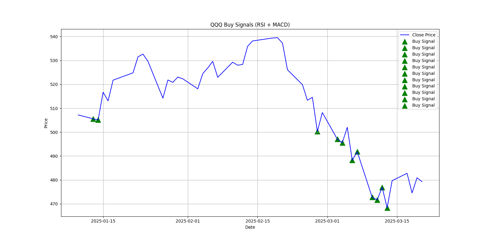

### 股票抄底信号检测系统（RSI + MACD）

### 📈 项目简介

这是一个基于 Python 的简单股票技术指标分析程序。通过下载美股（或其他股票）的历史数据，计算 RSI（相对强弱指标）和 MACD（指数平滑异同移动平均线），辅助检测可能的抄底买入信号，并以图表形式展示。

主要功能包括：

- 自动下载股票历史数据（使用 `yfinance`）
- 计算 RSI 和 MACD 技术指标
- 策略条件：当 RSI 小于 30 时，判断为潜在抄底信号
- 图形化展示收盘价和买入信号
- 数据结果展示

---

### 🏗️ 文件结构

```
.
├── main.py          # 主程序文件
└── README.md        # 项目说明文档
```

---

### ⚙️ 环境依赖

运行代码前请确保 Python 环境已安装以下库：

```bash
pip install yfinance pandas numpy matplotlib
```

---

### 🔧 使用方法

#### 1. 修改参数
在 `main.py` 文件中，可以自定义以下参数：

```python
ticker = 'QQQ'                # 股票代码
start_date = '2025-01-10'     # 起始日期
end_date = '2025-03-30'       # 结束日期
```

#### 2. 运行代码

```bash
python analysis.py
```

#### 3. 输出结果
- 控制台将打印出 RSI、MACD 等完整数据
- 买入信号输出：
  
  ```
  === QQQ 抄底信号 ===
  2025-02-15 → 抄底价: 328.45
  2025-03-05 → 抄底价: 315.78
  ```

- 自动弹出图形窗口，展示收盘价和检测到的买入信号。

---

### 🔍 策略说明

#### RSI（Relative Strength Index）
- 衡量股票在一定时间内的超买或超卖情况。
- RSI < 30 视为超卖，可能有反弹需求。

#### MACD（Moving Average Convergence Divergence）
- 判断价格走势的强弱与趋势变化。
- 本代码未基于 MACD 直接给出买入信号，但未来可以扩展。

---

### 📊 示例图

> 示例图将在运行 `plot_signals` 方法后弹出



*图片仅为演示，具体图片需要运行程序生成*

---

### 🚀 未来优化方向

- 支持更多股票筛选与批量分析
- 增加均线交叉等其它买卖策略
- 自动化定时任务（定期抓取和发送交易信号）
- 支持回测功能

---

### 🙋‍♂️ 作者

- **Chongyu Yuan**
- 邮箱: chongyu@matt3r.ai
- GitHub: [Yuanchongyu](https://github.com/Yuanchongyu)

---

> 如有疑问或改进建议，欢迎交流！

